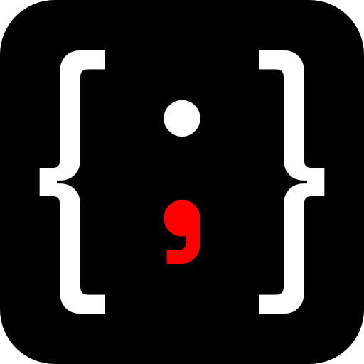

<p align="center">
  
</p>

# Syntax Bot

Ein Coding-Agent auf Basis des [Pi Agent](https://github.com/earendil-works/pi),
der Rechtschreib- und Syntaxfehler korrigiert, **ohne sich in die Logik
einzumischen**. Gedacht als Hilfsmittel bei einer Lese-Rechtschreib-Schwäche
(LRS): Beim Programmieren soll der Gedanke zählen, nicht die Rechtschreibung.

Die vollständige Architektur steht in
[`Syntax-Bot-Specification.md`](Docs/Syntax-Bot-Specification.md), der aktuelle
Arbeitsstand in [`HANDOFF.md`](Docs/HANDOFF.md).

## Die drei Modi

| Befehl | Was er darf | Werkzeuge |
|---|---|---|
| `/syntax-fix` | Nur Rechtschreibung und Syntaxfehler | `read`, `grep`, `find`, `ls`, `edit` |
| `/code-fix` | Zusätzlich echte Fehler und Struktur | dazu `write` und `bash` (frei) |
| `/cleanup` | Nur Struktur und Formatierung, **keine** Logikänderung | wie Syntax Fix, dazu `bash` nur für Formatter/Linter |

Dazu kommen:

- `/modus` — zeigt, welcher Modus aktiv ist.
- `/modus-aus` — beendet den Modus, voller Werkzeug-Zugriff.

Ein Modus ist kein eigenes Produkt, sondern nur eine Einschränkung auf demselben
Agenten: ein System-Prompt-Fragment plus eine Liste erlaubter Werkzeuge. Der
aktive Modus überlebt einen Neustart und wird beim Fortsetzen der Session
wiederhergestellt.

## Installation und Start

Voraussetzung: **Node.js 22.19 oder neuer**.

### Erste Schritte

```bash
# Repository klonen und ins Verzeichnis wechseln
git clone https://github.com/GONKstupid/Syntax-Bot.git
cd Syntax-Bot

# Abhängigkeiten installieren
npm install

# Pi-Runtime installieren und Entwicklungsumgebung einrichten
npm run setup
```

`npm run setup` richtet die isolierte Pi-Instanz ein (`~/.syntax-bot/runtime/`) und verlinkt die Peer-Abhängigkeiten (`ws`, `typebox`, Pi-Pakete) in `node_modules/`.

Danach stehen die folgenden Befehle bereit:

```bash
# Web-Server starten
npm run web

# IDE-Adapter starten (für Zed / VS Code über ACP)
npm run ide
```

Die Start-Skripte (`scripts/syntax-bot.ps1` bzw. `.sh`) führen den Bootstrap automatisch aus — dort genügt ein einmaliger Aufruf.

### Windows

```powershell
# Einmalige Einrichtung
.\scripts\syntax-bot.ps1

# Web-Server starten
npm run web
```

### Linux / macOS

```bash
# Einmalige Einrichtung
bash scripts/syntax-bot.sh

# Web-Server starten
npm run web
```

Alle weiteren Argumente werden an Pi durchgereicht, z. B. `.\scripts\syntax-bot.ps1 --model anthropic/claude-sonnet-5`.

### Eigene, isolierte Instanz

Syntax Bot benutzt bewusst **nicht** ein eventuell schon installiertes `pi`,
sondern eine eigene Kopie:

```
~/.syntax-bot/runtime/   eigene npm-Installation des Pi Coding Agent
~/.syntax-bot/agent/     PI_CODING_AGENT_DIR: Sessions, Anmeldedaten, Einstellungen
```

Beim Start wird die installierte Version gegen npm geprüft und bei Bedarf
aktualisiert, bevor die Session beginnt.

| Umgebungsvariable | Wirkung |
|---|---|
| `SYNTAX_BOT_HOME` | anderer Ort statt `~/.syntax-bot` |
| `SYNTAX_BOT_NO_UPDATE=1` | Versionsprüfung überspringen (offline) |
| `SYNTAX_BOT_PI_VERSION` | feste Pi-Version statt `latest` |

Manuell aktualisieren:

```bash
bash scripts/update-pi.sh --check   # nur den Stand anzeigen
bash scripts/update-pi.sh           # aktualisieren
```

### Modell auswählen

Die Modellwahl liegt vollständig bei Pi — API-Key, Subscription-Login oder
lokales Modell. Im laufenden Agenten `/login` eingeben oder einen API-Key als
Umgebungsvariable setzen (`ANTHROPIC_API_KEY`, `OPENAI_API_KEY`, …).

## Diff-First

Syntax Bot schreibt nie ungefragt in eine Datei. Vor jedem `write`- oder
`edit`-Aufruf erscheint der Diff und muss bestätigt werden. Das ist gerade als
LRS-Hilfsmittel der Kern der Sache: Es sollen keine stillschweigend neuen Fehler
entstehen.

- In nicht-interaktiven Betriebsarten (`-p`, `--mode json`) gibt es niemanden,
  der bestätigen könnte — dort werden Schreibvorgänge blockiert.
- `--auto-apply` schaltet die Rückfrage ab. Nur bewusst verwenden.

## Pi-Pakete installieren

Sag es einfach im Chat:

> Bitte installiere die Web-Access-Extension: `pi install npm:pi-web-access`

Syntax Bot leitet daraus den Befehl ab und **fragt vor jeder Installation
ausdrücklich nach**. Pi-Pakete laufen mit vollem Systemzugriff — die Rückfrage
lässt sich nicht abschalten. Neue Extensions werden nach `/reload` oder einem
Neustart aktiv.

## Cleanup-Stilgrundlage

Maßstab für `/cleanup` ist eine eigene, kurze Zusammenfassung etablierter
Formatierungsregeln — gebündelt im Prompt-Fragment
`extensions/shared/prompts/cleanup.md`. Eine externe Stildatei wird nicht
mitgeliefert (die frühere, GPL-2.0-lizenzierte Kernel-`coding-style.rst` ist
entfernt).

## Syntax Bot in Zed (IDE-Anbindung)

Syntax Bot spricht den [Agent Client Protocol](https://agentclientprotocol.com)
und lässt sich damit als External Agent direkt in Zed betreiben — mit Chat im
Agent-Panel, nativen Diff-Dialogen und den drei Modi als Slash-Commands bzw.
Modus-Umschalter.

Einmalig die isolierte Instanz einrichten (`scripts/syntax-bot.ps1` bzw.
`.sh`), dann in Zeds `settings.json` ergänzen:

```json
{
  "agent_servers": {
    "Syntax Bot": {
      "type": "custom",
      "command": "node",
      "args": ["C:\\Pfad\\zu\\Syntax-Bot\\ide\\index.ts"]
    }
  }
}
```

Der Adapter findet die isolierte Instanz über `~/.syntax-bot/agent`
(über `SYNTAX_BOT_HOME` bzw. `PI_CODING_AGENT_DIR` veränderbar). Im Panel
stehen die drei Modi als Commands bereit; dazu `/login` — ein geführter
Dialog direkt im Chat (API-Key, Anmeldung im Browser für Claude Pro/Max
& Co., oder eigener OpenAI-kompatibler Endpunkt) — sowie `/model`, `/new`,
`/compact`, `/tools`, `/stats`, `/reload`, `/settings` (Einstellungen im
Chat ändern), `/modus`, `/modus-aus` und `/help`. Jede Datei-Änderung
erscheint vor dem Schreiben als Bestätigungsdialog.

## Syntax Bot in VS Code (eigenständige Extension)

Für Rechner, auf denen zwar VS-Code-Extensions installiert werden dürfen,
aber keine weiteren Programme (kein Node, kein CLI-Agent): Die Extension
bringt **alles mit** — die Pi-Laufzeit läuft gebündelt im Extension-Host,
die Konfiguration liegt im von VS Code verwalteten Speicher. Modell kommt
per `/login` dazu (API-Key, Browser-Anmeldung oder eigener Endpunkt).

Extension bauen und als VSIX installieren:

```bash
npm run build:vscode                       # vscode/dist/ erzeugen
cd vscode
npx @vscode/vsce package                   # syntax-bot-<version>.vsix
code --install-extension syntax-bot-*.vsix # oder per UI: „Aus VSIX installieren“
```

Danach das Syntax-Bot-Symbol in der Aktivitätsleiste öffnen. Die drei Modi
sitzen als Dot-Leiste in der Kopfzeile, Diff-Rückfragen erscheinen als
Übernehmen/Verwerfen-Karte direkt über der Eingabe.

## Syntax Bot in VS Code (über ACP)

VS Code hat kein natives ACP — über die Community-Extension
[**ACP Client**](https://marketplace.visualstudio.com/items?itemName=formulahendry.acp-client)
(`formulahendry.acp-client`, MIT) spricht VS Code aber dasselbe Protokoll wie
Zed. Der Adapter bleibt derselbe (`ide/index.ts`), es kommt nur Konfiguration
dazu:

1. Extension „ACP Client" aus dem Marketplace installieren (Node.js 18+
   muss im `PATH` sein).
2. Einmalig die isolierte Instanz einrichten (`scripts/syntax-bot.ps1`).
3. In der VS Code `settings.json` ergänzen:

```json
{
  "acp.agents": {
    "Syntax Bot": {
      "command": "node",
      "args": ["C:\\Pfad\\zu\\Syntax-Bot\\ide\\index.ts"]
    }
  }
}
```

4. ACP-Symbol in der Aktivitätsleiste öffnen, „Syntax Bot" anklicken,
   chatten. Die drei Modi erscheinen als Slash-Commands bzw.
   Modus-Auswahl; Diff-Rückfragen kommen als Berechtigungsdialog.

Falls sich etwas anders als in Zed verhält, liefert der Befehl
„ACP: Show Protocol Traffic“ den JSON-RPC-Verkehr zum Vergleich.

## Syntax Bot im Web

```bash
npm run web   # http://127.0.0.1:4711 (Port: SYNTAX_BOT_WEB_PORT)
```

Beim ersten Besuch kann ein Konto angelegt werden (Nutzername, E-Mail,
Passwort — lokal gespeichert, Passwort als scrypt-Hash). Mit Konto merkt
sich Syntax Bot die verbundenen Modell-Anbieter (API-Key, Anmeldung im
Browser für Claude Pro/Max & Co., oder eigener OpenAI-kompatibler
Endpunkt) und sammelt eine Thread-History: Über das ⋯-Menü lassen sich
alte Gespräche öffnen und mit vollem Modell-Kontext fortsetzen. „Ohne
Konto fortfahren“ bleibt möglich — dann wird allerdings nichts gemerkt.

Jede Verbindung arbeitet in einem abgeschotteten Arbeitsbereich; `bash`
ist standardmäßig blockiert (`SYNTAX_BOT_WEB_BASH=1` schaltet es frei).

| Umgebungsvariable | Wirkung |
|---|---|
| `SYNTAX_BOT_WEB_PORT` | anderer Port statt 4711 |
| `SYNTAX_BOT_PUBLIC_BIND=1` | ins Netz binden (Standard: nur `127.0.0.1`) |
| `SYNTAX_BOT_SECURE=1` | Session-Cookie mit `Secure` (hinter HTTPS-Proxy) |
| `SYNTAX_BOT_TRUST_PROXY=1` | `X-Forwarded-For` für Rate-Limits auswerten |
| `SYNTAX_BOT_MAX_SESSIONS` | max. parallele Verbindungen pro Konto (Standard 2) |

## Entwicklung

```
extensions/
├── core/         Diff-Guard, /modus, /modus-aus, Meta-Werkzeug für Pi-Pakete
├── shared/       gemeinsamer Modus-Kern, Bash-Allowlist, Prompt-Fragmente
├── syntax-fix/   Modus „Syntax Fix"
├── code-fix/     Modus „Code Fix"
└── cleanup/      Modus „Cleanup" samt Stilquelle
scripts/          Bootstrap, Start, Update
test/             Tests für Modus-Grenzen und Leitplanken
```

Die Prompt-Fragmente in `extensions/shared/prompts/` sind normale
Markdown-Dateien und werden bei jedem Zug neu gelesen — Änderungen wirken sofort,
ohne Neustart.

```bash
npm test   # verlinkt die Pi-Pakete und führt die Test-Suite aus
```

Die Tests laden die echten Extensions gegen einen Stub der Pi-Schnittstelle und
prüfen unter anderem, dass `/syntax-fix` keine Shell öffnet und `/cleanup` nur
Formatter ausführen kann.

## Bekannte Lücken

Phase 1 und Phase 2 der Roadmap sind weitgehend umgesetzt: Web-Agent (mit
Konto-System/BYOM/Thread-History) läuft, die IDE-Anbindung ist für Zed nativ und für VS Code über
die Community-Extension „ACP Client“ umgesetzt. Offen sind
die Vertiefung der IDE-Anbindung (Kontext wie offene Datei/Selektion)
sowie eine formale Prüfung der Logik-Unveränderlichkeit im
Cleanup-Modus — Details in `Docs/HANDOFF.md`.
